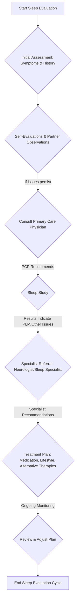

# Ideas & Project Drafts

> Preserved from `posts/me.md`, `posts/long/sleep analysis plan.md`, `posts/digital-piano-enhancements.md`, `posts/new-starburst-guitar.md`, and `posts/ulu-knife-handle-roughcut.md`.

---

## 1. M.E. (Mental Entity / My Essence)

**Concept**: A completely local, offline AI companion carried on your person (button, eyeglasses, lapel clip).

### Core Characteristics:
- **Perspective & Context**: Observes and listens from the user's perspective over years. Knows historical context, routines, and nuances, enabling effortless, high-trust communication and control.
- **Subtle Interaction**: Understands simple physical gestures (nod, gesture, conversational affirmations) and environmental context; communicates back via haptics, audio cues, visual cues, or local REST APIs.
- **Privacy & Memory Architecture**: Does not bulk-record raw audio or video. Learns and consolidates memories akin to human recall: repetition strengthens memory, while one-off moments merge into background context. Built by training or fine-tuning local on-device models.
- **Potential Name Expansions**:
  - *Mental Entity* – Cognitive assistant.
  - *My Essence* – Deep personal connection adapting to lived experience.
  - *Mental Engine* – Context-aware cognitive processor.
  - *Mind Echo* – Reflecting user thoughts and intentions.
  - *Memory Engine* – Adaptive memory synthesis.

---

## 2. Sleep Health & Movement Evaluation Plan

**Background**: Addressing sleep movement issues (periodic limb twitching, vocalization during sleep) and their impact on partner Sheryl. Avoiding pharmaceutical dependence; prioritizing lifestyle, nutrition, physical alignment, and integrative approaches.

### Clinical Assessment Instruments:
- **RLSRS** (Restless Legs Syndrome Rating Scale)
- **IRLSSG Rating Scale** (International RLS Study Group)
- **PSQI** (Pittsburgh Sleep Quality Index)
- **ESS** (Epworth Sleepiness Scale)
- **BDI-II** & **GAD-7** (Mood and anxiety screening)
- **Actigraphy & Sleep Diary** (Tracking bedtimes, wake events, latency, triggers like stress or late-night sugar)

### Evaluation Flow:

### Medical Care Contacts:
- **Primary Care**: Dr. James Runke (Michigan Avenue Primary Care / Advocate Illinois Masonic Medical Center, Chicago, IL). Certified by ABIM; graduate of University of Wisconsin.

---

## 3. Musical Instruments & Craft Pursuits

- **Digital Piano Enhancements**: Hardware and ergonomic modifications to Kawai-ES8 digital piano.
- **Cordoba Stage Nylon Electric Guitar**: Thin-line acoustic-electric nylon string guitar in Edge Burst finish.
- **Ulu Knife Handle Roughcut**: Handcrafting and shaping a custom wooden handle for an Alaskan-style Ulu blade.
