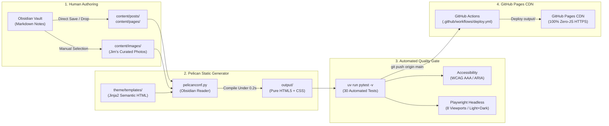
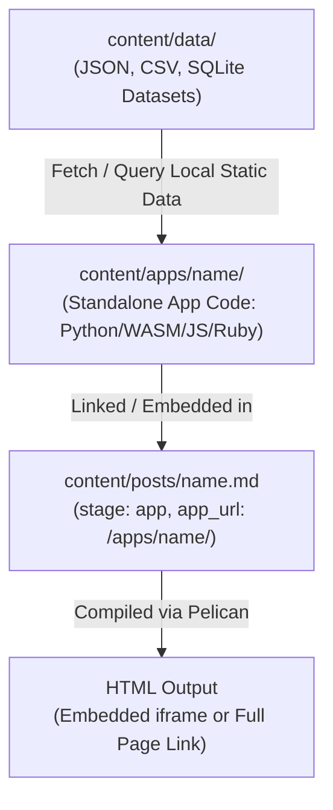
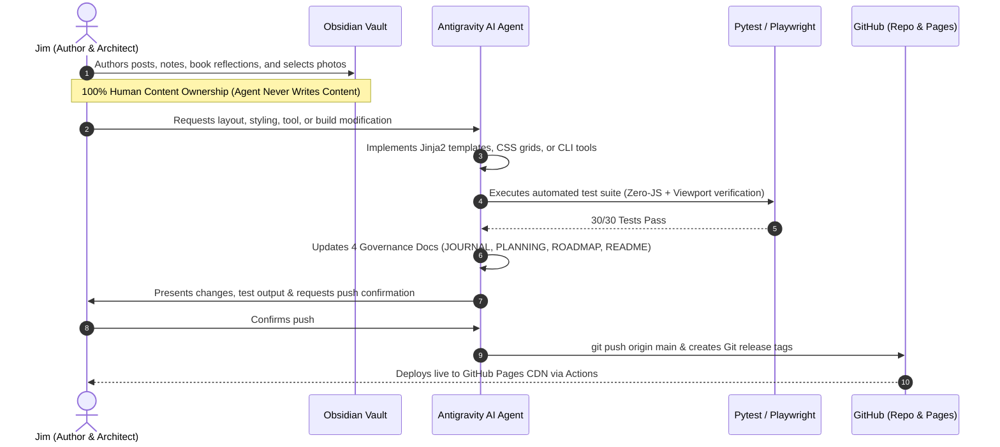

# Site Architecture & Publishing Flow — Cheat Sheet

> Quick reference guide for static site compilation, data flows, pair programming governance, and CI/CD operations.
> Printable PDF: [`architecture_flow.pdf`](file:///c:/Users/jimco/Projects/jimcollinsworth.github.io/docs/cheatsheets/architecture_flow.pdf)

---

## 1. End-to-End Publishing Pipeline



---

## 2. Interactive Apps & Static Data Architecture



*Every interactive app is paired with a companion post (`stage: app`) documenting its architecture, rationale, and evolution.*

---

## 3. Antigravity AI Pair Programming Governance



---

## 4. Core Governance Documents Matrix

| Document | Role & Primary Purpose | Update Trigger |
| :--- | :--- | :--- |
| **[`README.md`](file:///c:/Users/jimco/Projects/jimcollinsworth.github.io/README.md)** | Architecture overview, CLI guide & component lexicon. | New tools, syntax, or commands. |
| **[`PLANNING.md`](file:///c:/Users/jimco/Projects/jimcollinsworth.github.io/PLANNING.md)** | Active sprint tasks, near-term milestones & statuses. | Every milestone completion. |
| **[`ROADMAP.md`](file:///c:/Users/jimco/Projects/jimcollinsworth.github.io/ROADMAP.md)** | Long-term creative sandbox, wishlists & concept specs. | New exploratory concepts. |
| **[`JOURNAL.md`](file:///c:/Users/jimco/Projects/jimcollinsworth.github.io/JOURNAL.md)** | Chronological technical decision log & troubleshooting. | Every commit / session. |

---

## 5. Essential CLI Commands

```bash
# 1. Dependency Sync
uv sync

# 2. Build Pelican Static Site
uv run pelican content -s pelicanconf.py -o output -d

# 3. Local Development Preview Server
uv run pelican --listen -p 8000

# 4. Run Full Test Suite (Accessibility + E2E + Playwright)
uv run pytest -v

# 5. Generate Multi-Resolution Screenshots (8 Viewports)
uv run python tools/screenshots.py --page index.html

# 6. Generate PDF Cheat Sheets
uv run python tools/generate_cheatsheet_pdfs.py
```
