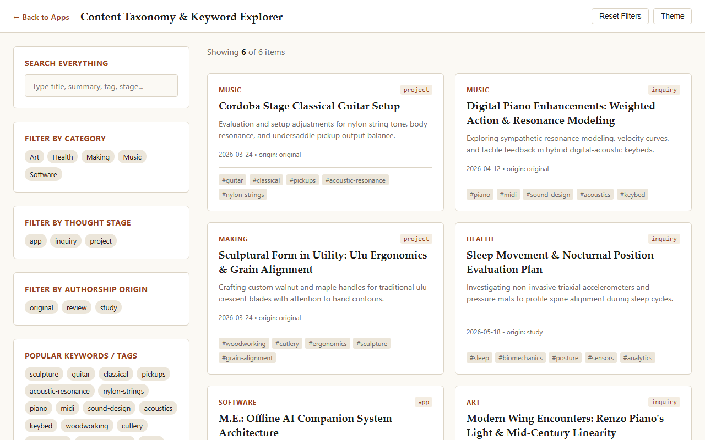

---
title: "Content Taxonomy & Keyword Explorer"
slug: "keyword-explorer-taxonomy"
date: "2026-09-12"
category: "AI"
author: "Jim Collinsworth"
authors: "Jim Collinsworth, LLM-Gemini3.8"
type: "APP"
tags:
  - software
  - taxonomy
  - search
  - metadata
summary: "A client-side visual discovery widget that cross-filters site content across domains, thought evolution stages, authorship origins, and multi-label keyword tags."
---

The **Content Taxonomy & Keyword Explorer** provides faceted discovery across the essays, projects, and notes on `jimcollinsworth.github.io`. It allows filtering across multiple dimensions simultaneously with real-time text matching.

[Launch Full-Screen App &rarr;](../apps/keyword-search/index.html){: .app-launch-btn }

## Faceted Discovery Dimensions

1. **Core Domains**:
   Categorizes content across the site's primary topic streams including Art, Health, Making, Music, and Software.
2. **Thought Evolution Stages**:
   Tracks notes through their development lifecycle: `idea` &rarr; `inquiry` &rarr; `project` &rarr; `app` &rarr; `article`.
3. **Authorship Origins**:
   Classifies posts by intellectual origin: `original` research, `study` notes, `review` analyses, and `curation` digests.
4. **Multi-Label Keywords**:
   Interactive keyword tags enabling cross-cutting exploration of topics like somatics, acoustic resonance, woodworking, and local AI.

## Application Access & Resources

- **Full-Screen Application**: [Launch Full-Screen Keyword Explorer &rarr;](../apps/keyword-search/index.html)
- **Site Index Data**: [View site-index.json &nearr;](../data/site-index.json)
