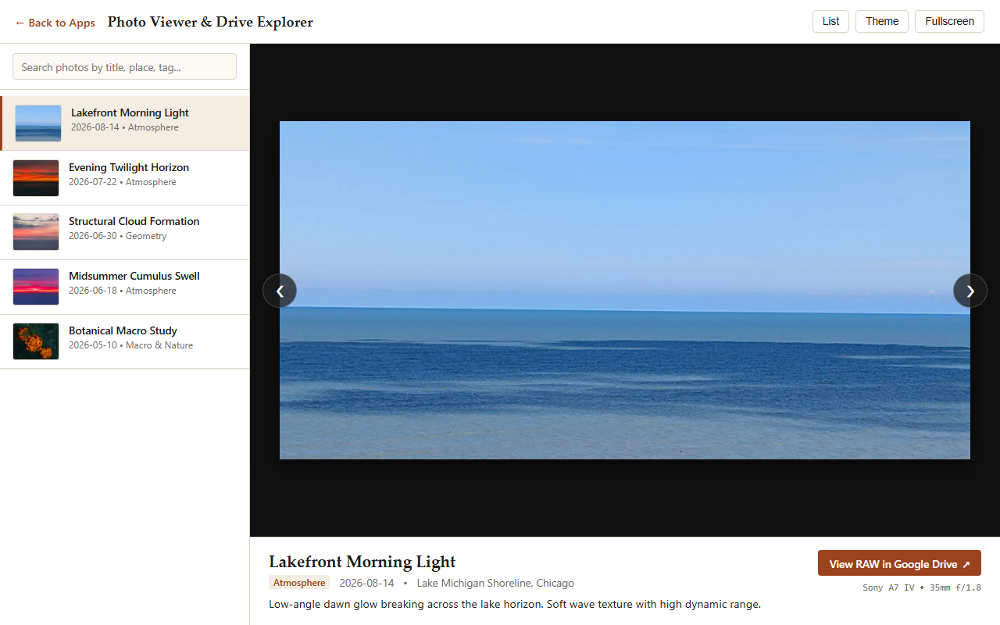

  

    The <strong>Photo Viewer &amp; Drive Manifest Explorer</strong> is a responsive client-side application designed to browse photo collections from central data manifests. It pairs lightweight previews with full camera telemetry and direct resolution to original RAW camera files hosted in Google Drive.
  

<figure>
  
  <figcaption>Photo Viewer &amp; Drive Manifest Explorer with filmstrip navigation and camera metadata inspector.</figcaption>
</figure>

## Design & Architecture

1. **Manifest-Driven Catalog**:
   The viewer parses data directly from `content/data/photos.json`. Dates, titles, subjects, and camera settings remain separated from display templates.
2. **Camera Telemetry Inspector**:
   Extracts and displays Sony A7 IV metadata, including lens specifications (e.g. 35mm f/1.8), aperture settings, shutter speeds, and ISO values for each exposure.
3. **Dual Storage Resolution**:
   Web-optimized preview assets are loaded for fast browsing, while direct action links connect to full-resolution RAW captures stored in Google Drive.
4. **Keyboard & Touch Navigation**:
   Supports arrow keys, filmstrip clicks, full-screen toggle, and light/dark theme switching.

## Application Access & Resources

- **Full-Screen Application**: [Launch Full-Screen Photo Viewer &rarr;](../apps/photo-viewer/index.html)
- **Data Manifest (JSON)**: [View photos.json &nearr;](../data/photos.json)
- **Data Manifest (Markdown)**: [View photos.md Table &rarr;](../data/photos.md)
