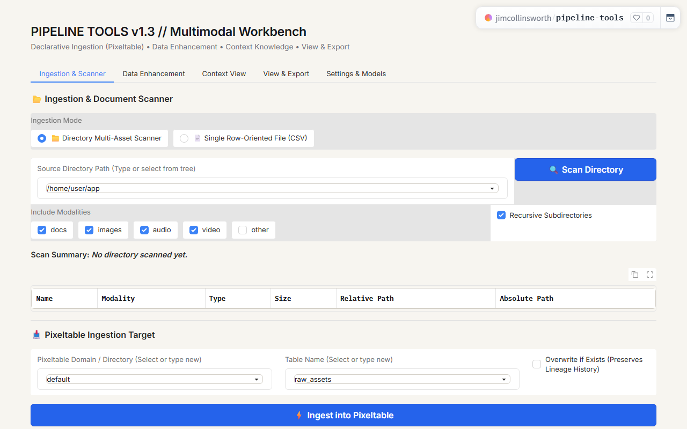

**Pipeline Tools** is an interactive multimodal data pipeline and transformation workbench hosted on Hugging Face Spaces. It provides utilities to scan multi-asset directories, connect to cloud stores, manage declarative tables via Pixeltable, execute quality validation models, and export structured datasets.

[Launch Full-Screen App &rarr;](../apps/pipeline-tools/index.html){: .app-launch-btn }

## Workbench Capabilities

1. **Multimodal Directory Scanning**:
   Recursively inspects local or mounted directories for documents (`.pdf`, `.txt`, `.docx`), images (`.jpg`, `.png`), audio files, and video streams with metadata extraction.
2. **Declarative Ingestion with Pixeltable**:
   Binds asset directories into versioned Pixeltable tables with automatic schema validation, change tracking, and incremental updates.
3. **Data Enhancement & Transformation**:
   Applies multimodal embeddings, text chunking, and AI metadata extractors for downstream analytics and search workflows.
4. **Structured Data Export**:
   Outputs validated datasets and contextual knowledge tables into standard data formats.

## Application Access & Resources

- **Full-Screen Workbench**: [Launch Full-Screen App &rarr;](../apps/pipeline-tools/index.html)
- **Hugging Face Space**: [Open Space in Hugging Face &nearr;](https://huggingface.co/spaces/jimcollinsworth/pipeline-tools)
- **Direct Application Host**: [jimcollinsworth-pipeline-tools.hf.space &nearr;](https://jimcollinsworth-pipeline-tools.hf.space)
- **Source Code & Documentation**: [GitHub Repository & README &nearr;](https://github.com/jimcollinsworth/pipeline-tools)
