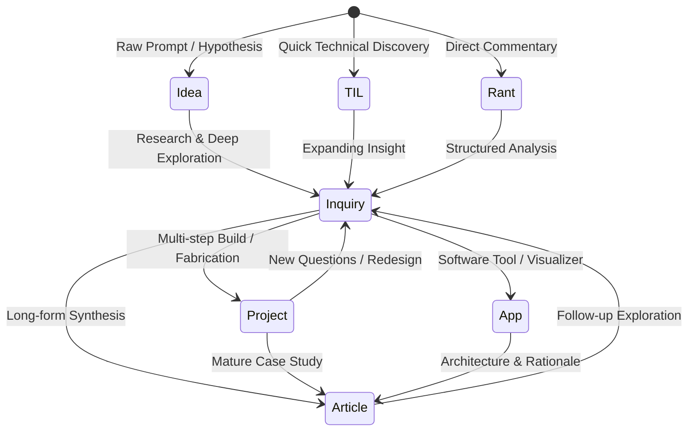
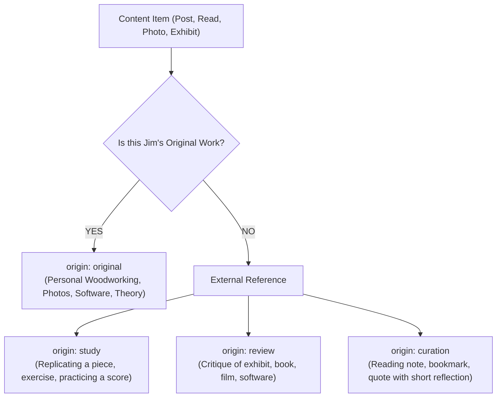
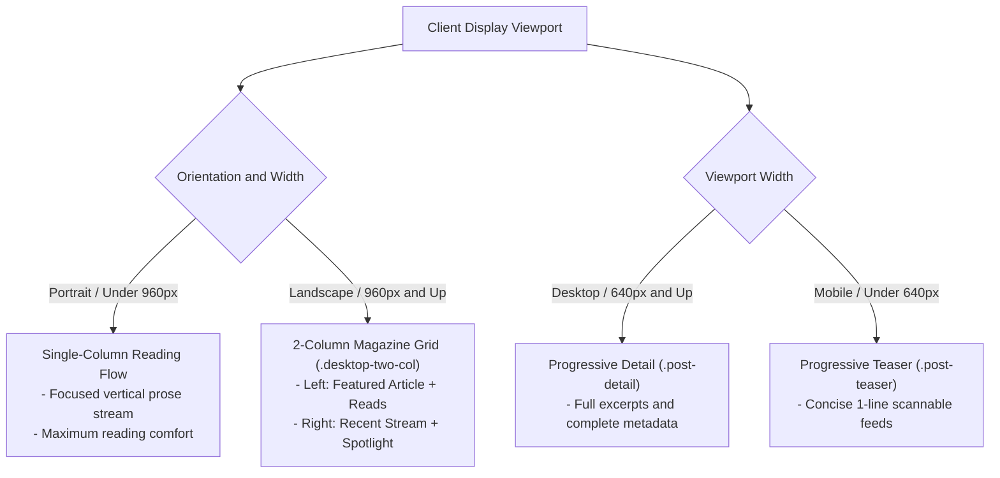

# Content Authoring & Layout Relationship — Cheat Sheet

> Authoring reference for Pelican YAML metadata, thought evolution lifecycles, authorship boundaries, and semantic layout styling.
> Printable PDF: [`content_authoring.pdf`](file:///c:/Users/jimco/Projects/jimcollinsworth.github.io/docs/cheatsheets/content_authoring.pdf)

---

## 1. Thought Evolution Lifecycle



*Posts are living thoughts that mature across stages over time using the `evolution:` audit log.*

---

## 2. Authorship & Origin Boundary



---

## 3. Standard Pelican YAML Frontmatter Template

```yaml
---
title: "Cordoba Stage Classical Guitar Setup"
slug: "cordoba-stage-guitar"
date: 2026-03-24
modified: 2026-09-09

# 1. Primary Classification (The 12 Core Domains)
category: Music          # Music, Software, Health, Making, Art, Law,
                         # Politics, Data, Exercise, Anatomy, Engineering

# 2. Multi-Label Topics & Keywords
tags: [guitar, classical, pickups, acoustic-resonance]

# 3. Publishing Control & Summary Teaser
status: published        # published | draft | hidden
summary: "Evaluation and setup adjustments for nylon string tone."

# 4. Thought Evolution & Authorship
origin: original         # original | study | review | curation
stage: project           # idea | til | rant | inquiry | project | app | article
evolution: "2026-03-24:idea > 2026-06-10:inquiry > 2026-09-09:project"

# 5. Interactive Media & Apps (Optional)
app_url: ""              # e.g. /apps/circle-of-fifths/
gallery_url: ""          # e.g. Google Photos album URL
---
```

---

## 4. Markdown Syntax to Semantic CSS Component Mapping

| Component | Markdown / HTML Syntax | CSS Selector | Visual & Styling Behavior |
| :--- | :--- | :--- | :--- |
| **Site Header** | Template-driven | `.site-header`, `.site-nav` | Clean branding, active page highlight, and zero-JS accessibility controls. |
| **Lead Summary** | `<div class="page-intro">...</div>` | `.page-intro` | Slightly larger type (`1.15rem`) with generous margins for article ledes. |
| **Headings (H2-H4)** | `## Section`, `### Sub` | `h2`, `h3`, `h4` | Proportional margins, distinct serif/sans hierarchy, and clear section breaks. |
| **Body Prose** | Standard markdown paragraphs | `p`, `main p` | Readable measure capped at `max-width: 76ch` with `1.65` line-height. |
| **Quotes & Callouts** | `> Quote / mental model` | `blockquote` | Rust accent left border (`3px solid var(--accent)`), italicized, indented. |
| **Photo Figures** | `` | `figure`, `figcaption` | Bordered photo card with centered italicized caption below. |
| **Data Tables** | Pipe table: `\| Col 1 \| Col 2 \|` | `table`, `th`, `td` | Clean bordered table with shaded header row and horizontal row dividers. |
| **Code Snippets** | ` ```python ... ``` ` | `pre`, `code`, `.highlight` | Monospace block with card shading, dark mode support, and code syntax styles. |
| **Dashboard Grid** | `<div class="dashboard-grid">` | `.dashboard-grid` | Multi-column CSS Grid card layout for metrics, stats, and telemetry. |

---

## 5. Responsive Layout & Orientation Modes


