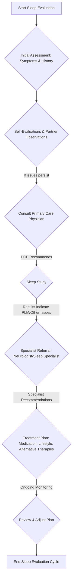

Sleep Plan

This document covers my health issues related to sleep, some serious due to its large impact on Sheryl, my partner. I am very averse to medications, so I want to include nutrition, exercise, and Eastern and alternative diagnosis and treatment options.

### Table of Contents
- [Symptoms](#symptoms)
- [Medical History](#medical-history)
- [Evaluations](#evaluations)
  - [Flowchart for Overall Evaluation](#flowchart-for-overall-evaluation)
  - [Self-Evaluations for Sleep and Leg Motion](#self-evaluations-for-sleep-and-leg-motion)
  - [External Resources](#external-resources)
- [Doctors](#doctors)
  - [Primary Care](#primary-care)

### Symptoms
Movement during sleep is the problem: leg/body twitching and vocalization. This happens more with stress and late-night sugar. Can go many nights without any issue (noticed by Sheryl).

### Medical History
- Sleep study was done (overnight, wired). Minimal apnea, some PLM. No hard recommendations.
- Acupuncture series — 6 sessions focusing on sleep quality.

### Evaluations
It is useful to do standardized clinical self-evaluations for leg motion, sleep, and neurological issues. Sheryl can also fill them out for my sleep hours.

#### Flowchart for Overall Evaluation

#### Self-Evaluations for Sleep and Leg Motion
To comprehensively evaluate leg motion, sleep quality, and potential neurological issues, regularly complete the following standardized self-assessments. Sheryl can also provide observations for sleep hours.

- Restless Legs Syndrome Rating Scale (RLSRS): Assesses severity of RLS symptoms, including frequency, intensity, and impact on sleep and daily life.
- International Restless Legs Syndrome Study Group (IRLSSG) Rating Scale: Quantifies severity of RLS; used in research and clinical settings.
- Pittsburgh Sleep Quality Index (PSQI): Global measure of sleep quality and disturbances over the past month; covers seven components including latency, duration, efficiency, disturbances, medication use, and daytime dysfunction.
- Epworth Sleepiness Scale (ESS): Assesses general level of daytime sleepiness in various situations.
- Beck Depression Inventory (BDI-II): Depression can impact sleep quality and movement disorders; assesses severity of depressive symptoms.
- Generalized Anxiety Disorder 7-item (GAD-7) Scale: Screens and measures severity of generalized anxiety, which can contribute to sleep disturbances and twitching.
- Actigraphy Data (optional): Wearable actigraphy can provide objective sleep-wake and limb movement data. Typically requires professional interpretation; for initial self-evaluation, a sleep diary may suffice.
- Sleep Diary: Daily log tracking bedtime, wake time, sleep latency, awakenings, and disturbances to identify trends and triggers.
- L-Dopa Response Test: Physician-guided trial of low-dose L-Dopa to assess whether symptoms improve; a positive response may support an RLS diagnosis.
- Nutritional and Lifestyle Factor Checklist: Track diet, caffeine/alcohol intake, exercise, and stress management per general health guidelines (e.g., WHO).

#### External Resources
- RLSRS: [https://www.rls.org/file/RLSRS.pdf](https://www.rls.org/file/RLSRS.pdf)
- IRLSSG Rating Scale: [https://www.irlssg.org/wp-content/uploads/2021/04/IRLSSG-Severity-Scale-1.pdf](https://www.irlssg.org/wp-content/uploads/2021/04/IRLSSG-Severity-Scale-1.pdf)
- PSQI: [https://www.sleep.pitt.edu/wp-content/uploads/2022/07/PSQI.pdf](https://www.sleep.pitt.edu/wp-content/uploads/2022/07/PSQI.pdf)
- ESS: [https://epworthsleepinessscale.com/wp-content/uploads/2017/08/ESS.pdf](https://epworthsleepinessscale.com/wp-content/uploads/2017/08/ESS.pdf)
- BDI-II (FAQ): [https://www.pearsonclinical.com/content/dam/marketing/clinical/assets/bdi-ii/bdi-ii-faq.pdf](https://www.pearsonclinical.com/content/dam/marketing/clinical/assets/bdi-ii/bdi-ii-faq.pdf)
- GAD-7: [https://patient.info/doctor/generalised-anxiety-disorder-7-gad-7-questionnaire](https://patient.info/doctor/generalised-anxiety-disorder-7-gad-7-questionnaire)
- Actigraphy (overview): [https://www.sleepfoundation.org/sleep-tools-wears/actigraphy](https://www.sleepfoundation.org/sleep-tools-wears/actigraphy)
- Sleep Diary (printable): [https://www.sleepfoundation.org/wp-content/uploads/2023/06/sleep-diary-printable-sleepfoundation.pdf](https://www.sleepfoundation.org/wp-content/uploads/2023/06/sleep-diary-printable-sleepfoundation.pdf)
- L-Dopa Response Test: (Physician-guided; no direct self-test document)
- WHO Diet & Nutrition Guidelines: [https://www.who.int/dietphysicalactivity/publications/trs916/en/](https://www.who.int/dietphysicalactivity/publications/trs916/en/)

### Doctors

#### Primary Care
Dr. James Runke is a caring internist currently practicing at Michigan Avenue Primary Care. He offers both virtual and in-person consultations and is also affiliated with Advocate Illinois Masonic Medical Center.

Certified by the American Board of Internal Medicine, Dr. Runke is skilled in patient evaluation, assessing medical history, and diagnosing a wide range of acute and chronic health conditions. He earned his Doctor of Medicine degree from the University of Wisconsin.

Dr. Runke is dedicated to the mental and physical well-being of his patients. Beyond treating illnesses, he educates and guides patients and their families on disease prevention and developing healthy lifestyles.
